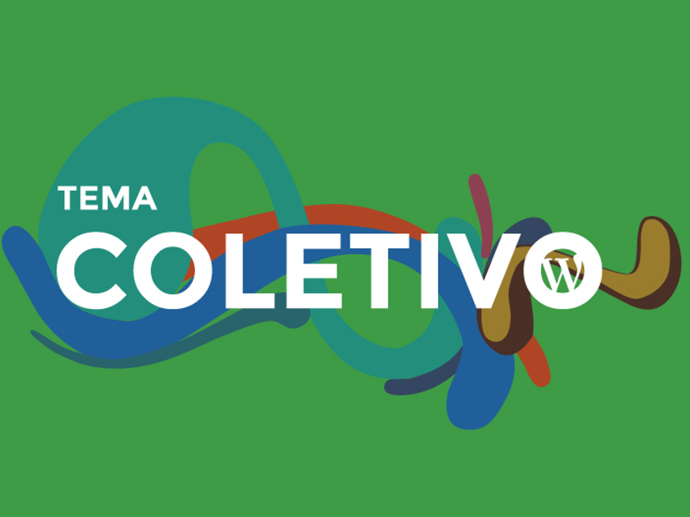

# Tema Coletivo

Fork do OnePress: https://wordpress.org/themes/onepress/

Coletivo is an outstanding creative and flexible WordPress theme well suited
for business, portfolio, digital agency, product showcase, freelancers and
everyone else who appreciate good design. Is a fork of the OnePress theme,
by Fame Themes.

* Contributors: [redelivre](https://github.com/redelivre), [brasadesign](https://profiles.wordpress.org/brasadesign/), [famethemes](https://profiles.wordpress.org/famethemes/), [congthien](https://profiles.wordpress.org/congthien/), [kientrong](https://profiles.wordpress.org/kientrong/), [diegorojas](https://profiles.wordpress.org/diegorojas/), [matheusgimenez](https://profiles.wordpress.org/matheusgimenez/), [2aces](https://profiles.wordpress.org/2aces/), [rodineicosta](https://profiles.wordpress.org/rodineicosta/)
* Tags: one-column, two-columns, left-sidebar, right-sidebar, fluid-layout, responsive-layout, custom-menu, featured-images, full-width-template, sticky-post, theme-options, threaded-comments, translation-ready, blue, light
* Tested up to: 5.2
* Stable tag: 1.7
* License: GPLv2 or later
* License URI: http://www.gnu.org/licenses/gpl-2.0.html

Coletivo is distributed under the terms of the GNU GPL

 

# capturas

## Installation

1. In your admin panel, go to Appearance > Themes and click the Add New button.
2. Click Upload and Choose File, then select the theme's .zip file. Click Install Now.
3. Click Activate to use your new theme right away.

## Frequently Asked Questions

### How to set up the blog page?
First create a page and give it a name ( Note this page will also be the URL of your blog, example "Blog", "News" ...  ), at the right site - Template section select Blog Page and then Save. Now you can access your blog at http://yourdomain.com/blog ( or http://yourdomain.com/news )

### How to set up the one page menu like the demo?

There are a lot of sections available in these theme: Hero, Features, Your Slider, Featured Page, Services, Portfolio, Video Lightbox, Gallery, Team, News, Contact.
For each section, you will need to create a text link menu with anchor point to the ID of the section, like:
	http://yourdomain.com/#features
	http://yourdomain.com/#yourslider
	http://yourdomain.com/#featuredpage
	http://yourdomain.com/#services
	http://yourdomain.com/#portfolio
	http://yourdomain.com/#videolightbox
	http://yourdomain.com/#gallery
	http://yourdomain.com/#team
	http://yourdomain.com/#news
	http://yourdomain.com/#contact
You can also change the section ID by going to Customizer -> Section: About ( for example. ) -> Section Settings -> Section ID.

## Credits
 - OnePress Contributors: famethemes, congthien, kientrong
OnePress Theme, Copyright 2015 FameThemes

 - Underscores
Based on Underscores http://underscores.me/, (C) 2012-2015 Automattic, Inc., [GPLv2 or later](https://www.gnu.org/licenses/gpl-2.0.html)

 - Normalize
normalize.css http://necolas.github.io/normalize.css/, (C) 2012-2015 Nicolas Gallagher and Jonathan Neal, [MIT](http://opensource.org/licenses/MIT)

 - Google Fonts

	Source: https://www.google.com/fonts/specimen/Raleway
	License: SIL Open Font License, 1.1 - scripts.sil.org/OFL

	Source: https://www.google.com/fonts/specimen/Open+Sans
	License: SIL Open Font License, 1.1 - scripts.sil.org/OFL

 - Unsplash images
    License: https://unsplash.com/license (http://creativecommons.org/publicdomain/zero/1.0 - CC0)

 - FitVids
    Source: https://github.com/davatron5000/FitVids.js/blob/master/jquery.fitvids.js
    License: Released under the WTFPL license - http://sam.zoy.org/wtfpl/

 - Morphext
    Source: http://morphext.fyianlai.com/
    License: The MIT License (MIT) - https://github.com/MrSaints/Morphext/blob/master/LICENSE

 - WOWjs
    Source: http://mynameismatthieu.com/WOW/
    License: https://github.com/matthieua/WOW/blob/master/LICENSE-MIT

 - Tether
    Source: https://github.com/HubSpot/tether
    License: https://github.com/HubSpot/tether#license MIT LICENSE

 - bootstrap
    Source: https://github.com/twbs/bootstrap
    License: https://github.com/twbs/bootstrap/blob/master/LICENSE MIT LICENSE

 - jQuery Parallax
    Source: http://www.ianlunn.co.uk/plugins/jquery-parallax/
    License: Dual licensed under the MIT and GPL licenses: https://github.com/IanLunn/jQuery-Parallax#jquery-parallax

 - FontAwesome
    Source: https://fortawesome.github.io/Font-Awesome/
    License: GPL - https://fortawesome.github.io/Font-Awesome/license/
